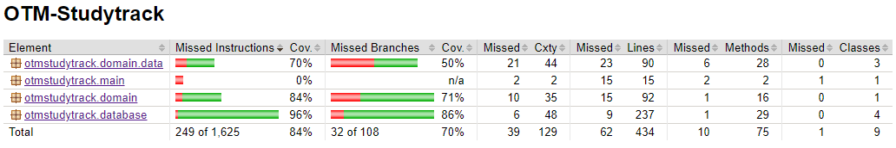

# Testing document

The program has been tested through both automated unit tests and manual testing by running the program through all typical use cases.

## Unit and integration testing

A hybrid, bottom-up form of testing has been used. Although constructed in the manner of unit tests, all tests use real dependencies as opposed to mocked ones, meaning successful execution of a class' tests requires successful execution of the tests of the classes which it is dependent on. This means the test of each class is not truly independent if it has any dependencies.  Implementing of testing was started from the bottom-most classes in the dependency hierarchy (i.e., classes which have no dependencies), and proceeded up the hierarchy only when the dependency tests passed.

### DAO classes

Dao classes have been tested by providing a clean slate database file for each test. The database is emptied between each test.

### Program logic

Program logic has been tested by testing the StudytrackService class, which provides all core program logic. As it makes use of the DAO classes as dependencies, these tests also test the functioning of the complete, integrated program, minus the user interface.

### Test coverage

The current stage of test coverage is not ideal, though its reasonable coverage combined with manual system testing provides a reasonable confidence of the program's functionality. The core logic and DAO classes have near-complete coverage, but the data classes currently lack tests of their own.

## System testing

System testing has been performed manually, by running the program and testing all the functionality provided to the user.

The program has been principally tested on a Linux platform running the release executable .jar files.
