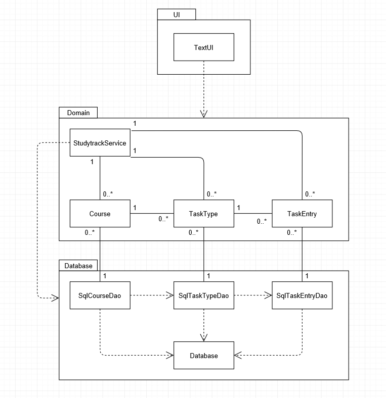

# Architecture description

## Structure

The overall structure of the program follows a three tier architecture with the following package structure:

## Text interface

The program currently uses a simple console interface. It is isolated from program logic through dependency injection: To interact with program logic, the TextUI class relies on an instance of StudytrackService passed to it as a cosntructor parameter.

## Program logic

Program logic

The types of user data handled by the program (courses, task types and task entries) are represented by their respective classes, which reside in the otmstudytrack.domain.data package. They possess the following structure:

--

 
